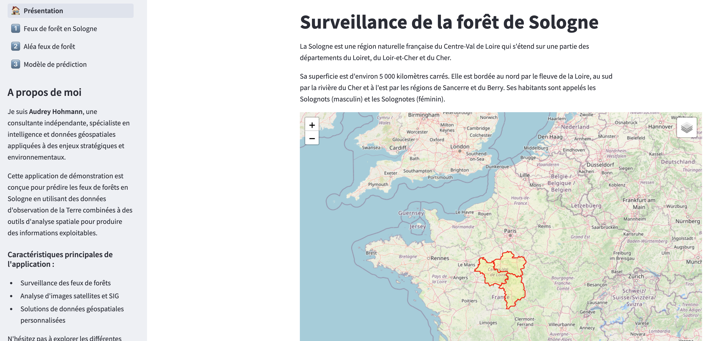

# geospatial_app_Sologne
# Demonstration of a geospatial streamlit multipage app applied to a wildfire score prediction

## Preamble
In the latest IPCC report, experts confirm that the increasing frequency and/or intensity of extreme climate events (floods, fires, coastal flooding, droughts, etc.) is directly related to climate change.

Wildfires have been particularly devastating in recent years across many countries worldwide, with alarming consequences. A systematic analysis of global fire activity, conducted by Jones et al. (2024), identifies extreme events during the fire season from March 2023 to February 2024.

Human factors contribute significantly to the development of wildfires. 
Human activities such as recreation, production, and transportation infrastructure (roads, railways) can cause the ignition and spread of fires. 
According to the French Forest Observatory, in metropolitan France, 90% of forest and vegetation fires are of human origin, with lightning being the only natural cause. In 70% of cases, these fires originate from economic activities (construction sites, agricultural activities, electrical networks, etc.) or daily activities (cigarette butts, barbecues or campfires, vehicle or garbage fires, etc.). The remaining 30% of fires of anthropic origin are due to malicious acts.

Geospatial data plays a crucial role in the spatialization of susceptibility factors and vulnerability assessment for wildfire risk management. By integrating multi-source spatial information, we can identify, quantify, and map the complex interactions between environmental conditions and human influences that contribute to fire risk.

- Remote sensing data from satellites provides valuable information on vegetation density, moisture content, and land cover changes over time. 
- Digital elevation models help quantify topographic factors such as slope, aspect, and elevation that influence fire behavior. 
- Population density maps and infrastructure networks allow us to assess human presence and activity patterns that correlate with ignition probability.

The integration of these diverse geospatial datasets enables the development of comprehensive risk models that account for both natural susceptibility factors (vegetation type, climate, topography) and anthropogenic variables (proximity to roads, population centers, land use patterns). This spatial approach not only improves our understanding of wildfire dynamics but also enables more targeted prevention strategies and resource allocation for vulnerable areas.

References :
1) Rapport du GIEC (https://www.ipcc.ch/report/ar6/syr/)
2) Article Jones, M. W., et al. (2024). State of Wildfires 2023–2024. Earth System Science Data, 16(9), 3601-3634. https://essd.copernicus.org/articles/16/3601/2024/
3) PPR Risques d'incendies de forêt (https://www.ecologie.gouv.fr/politiques-publiques/prevention-feux-foret)
4) Observatoire des forêts françaises (https://foret.ign.fr/)

## Primary objectives of the demonstration app
Leveraging geospatial data and advanced analytics to predict wildfire hazard classes at the municipal level based on susceptibility factors. This system utilizes Earth observation data, spatial analysis techniques, and machine learning to assess wildfire hazard for communes in the Sologne region of France, delivering actionable insights through an interactive Streamlit application.

### Key features
- Acquisition and analysis of multi-source geospatial data
- Utilization of this data in a machine learning model
- Application of these techniques to address a critical environmental challenge
- Development of a cloud-based application enabling users to visualize geospatial data and interact with the prediction model
## App screenshots 
   

   
## Dataset
The geospatial dataset used in this project incorporates comprehensive information on wildfire occurrences in the Sologne region, including administrative boundaries, elevation statistics, land cover classification, population estimates, and transportation infrastructure.

Data was sourced from multiple authoritative repositories:
- Administrative boundaries: IGN Admin Express and BD CARTO
- Topographic data: RGE ALTI 1m [accessed via Google Earth Engine]
- Wildfire records: BDIFF (Base de Données sur les Incendies de Forêts en France)
- Demographic information: INSEE BD POP historical database
- Land cover classification: CORINE Land Cover [accessed via Copernicus/Google Earth Engine]

Target variables are calculated from data entered into the BDIFF by authorized personnel. The completeness of the data entered cannot be guaranteed, despite the care taken in data collection, and caution should therefore be exercised when analyzing the results. 

## Project description
This project is built on a solid methodological foundation, supported by two Jupyter notebooks:

- An Exploratory Data Analysis (EDA) notebook that examines patterns and relationships in the geospatial data
- A modeling notebook that develops and evaluates predictive algorithms for wildfire hazard assessment

## Exploratory Data Analysis & Feature Engineering

### Spatial Data Processing
- Administrative boundary filtering for the Sologne region
- Geocoding wildfire incidents to commune centroids (chef-lieu)
- Quality control and missing value handling for spatial data integrity

### Temporal Analysis
- Seasonal patterns of wildfire occurrences
- Temporal distribution of fire events across the study period

### Geospatial Feature Extraction
- Zonal statistics from digital elevation models and derivatives using GEE/geemap
- Land cover classification analysis (CORINE Land Cover) by commune
- Road network density calculations (classified by road type)
- Population density metrics (people per km²)

### Target Variable Engineering
- Commune-level wildfire frequency aggregation
- Burnt area calculations and proportional analysis
- Regional normalization of fire indicators
- Weighted hazard score development using multiple susceptibility factors

### Statistical Analysis
- Anomaly detection in spatial patterns
- Feature-target relationship exploration
- Forest area burnt ratio analysis
- Outlier identification and handling

### Data Preparation
- Final dataset compilation for modeling
- Feature selection based on correlation analysis
- Output formatting for seamless integration with Streamlit application

## Modeling approach
* **Model Selection**: Implemented and compared multiple regression models including Ridge, ElasticNet, and ensemble methods (Random Forest Regressor and Gradient Boosting Regressor) to predict wildfire hazard classes at the commune level.
* **Model Evaluation**: Employed robust cross-validation strategies adapted for spatial data to minimize spatial leakage. Assessed model performance using multiple metrics including R², RMSE, and MAE to ensure comprehensive evaluation.
* **Variable Importance Analysis**: Identified land cover surface characteristics and road network density as the most significant predictors, confirming the importance of both environmental and anthropogenic factors in wildfire hazard assessment.
* **Spatial Validation**: Verified model predictions against known historical wildfire patterns to ensure spatial coherence of hazard predictions across the Sologne region.

## Prospects for improvement

* **Integration of Dynamic Factors**: Enhance the prediction model by incorporating meteorological parameters such as precipitation, temperature, air humidity, wind speed, and solar radiation. These dynamic variables significantly influence vegetation moisture content and constitute natural ignition factors.

* **Temporal Resolution Enhancement**: Implement a time-series approach to capture seasonal variations in wildfire risk, allowing for more timely and specific predictions.

* **Advanced Remote Sensing Data**: Incorporate higher resolution satellite imagery and vegetation indices (NDVI, EVI) to better assess fuel conditions and vegetation health status.

* **Machine Learning Pipeline Optimization**: Explore deep learning techniques and automated feature selection to improve model accuracy and computational efficiency.

* **Real-time Data Integration**: Develop capabilities to connect with weather API services for near-real-time risk assessment and early warning functionalities.

## Project Structure

```bash
geospatial_app_Sologne/
├── .streamlit/
│   └── config.toml          # Streamlit configuration settings
├── data/
│   ├── com_score.parquet    # Commune-level hazard score and class data
│   ├── com_sologne.parquet  # Sologne communes geographic data
│   ├── dept_sologne.parquet # Department-level geographic data
│   └── wildfire_sol.parquet # Wildfire data by commune
├── docs/
│   ├── view1_wildfireapp.png             # Screenshot of main application view
│   ├── view2_wilfire_data.png            # Screenshot of wildfire data visualization
│   ├── view3_wildfire_hazard_map.png     # Screenshot of hazard mapping interface
│   └── view4_wildfire-hazard_prediction.png # Screenshot of prediction interface
├── model/
│   └── rf_clf.joblib       # Serialized Random Forest classifier model
├── pages/
│   ├── 1_wildfires_data.py  # Streamlit page for wildfire data exploration
│   ├── 2_hazard_score.py    # Streamlit page for hazard scoring analysis
│   └── 3_wildfires_prediction.py # Streamlit page for prediction functionality
├── utils/
│   ├── __init__.py          # Package initialization file
│   ├── ml.py                # Machine learning utility functions
│   └── navigation.py        # Navigation helpers for the Streamlit app
├── home.py                  # Main entry point and home page of the application
└── README.md                # Project documentation (this file)

```

## How to use
### Clone this repository
```bash
git clone https://github.com/AuHoh/geospatial_app_Sologne.git
```

### Install required dependencies
```bash
pip install -r requirements.txt
```

### Launch the Streamlit app
```bash
streamlit run home.py
```


## Author
Audrey Hohmann, Geospatial data scientist

[My LinkedIn Profile](https://www.linkedin.com/in/audrey-hohmann/?locale=en_US)

[My professional website](https://www.audreyhohmann.com) 


## ⚠️ Disclaimer

**This is a demonstration application developed for portfolio purposes only.**

While this project has been developed by a geospatial data scientist with a solid background in natural hazard assessment, it should be noted that:

- This application has NOT been reviewed or validated by wildfire experts or forestry authorities
- The predictions are based on historical data and simplified models that may not capture all relevant factors
- The results should NOT be used for operational decisions related to wildfire management or risk assessment
- The application is meant to showcase geospatial data integration and analysis capabilities rather than provide definitive wildfire risk evaluations

## License
This project is licensed under the MIT License - see the LICENSE file for details.
